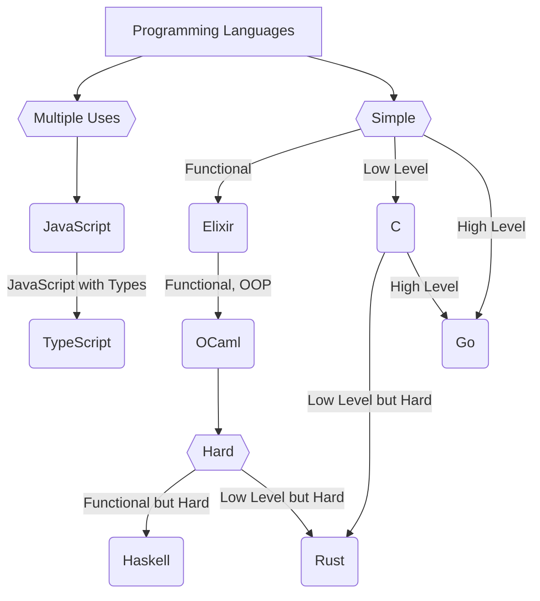

# What's this?

A general summary of the languages that I am interested in, alongside a roadmap on which I'd learn before starting another (in theory).

# Isn't this too simple?

That's the point. I haven't mentioned details (such as concurrency for Go and Elixir) for the sake of brevity.

There are a lot more things to say to those languages that I glanced over.

 

